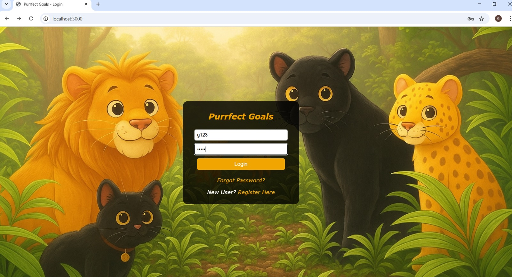
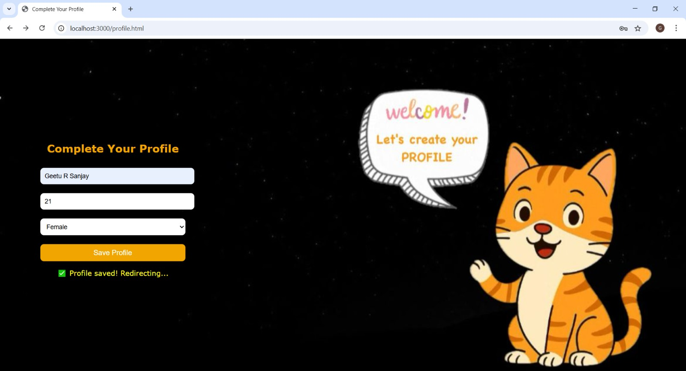
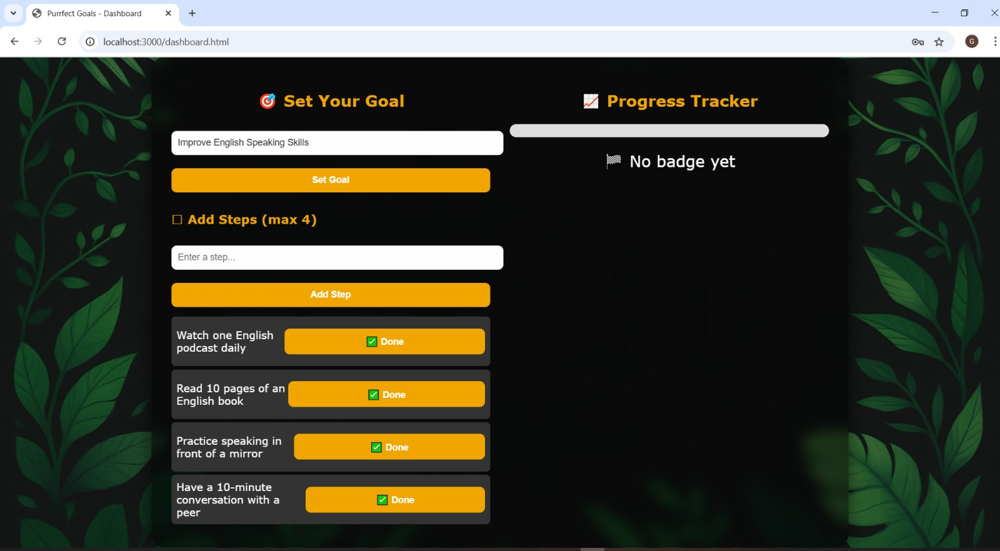
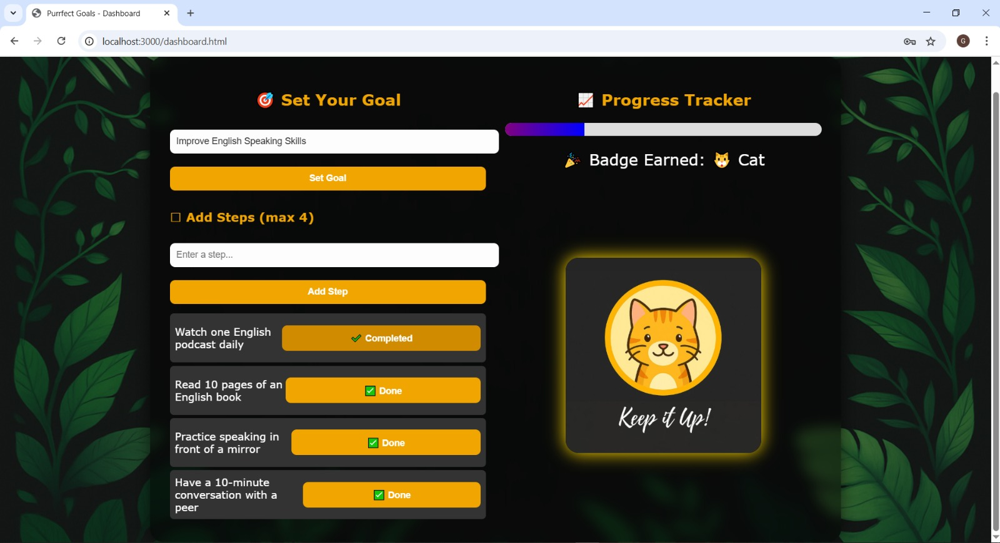
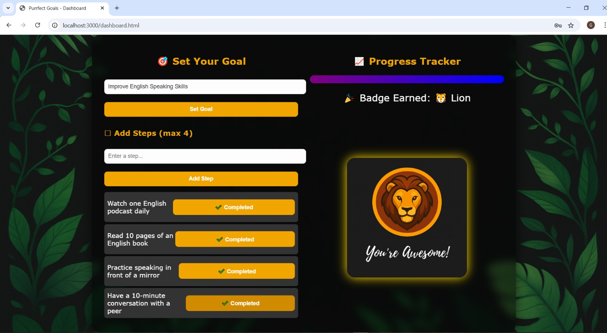

# 🐾 Purrfect Goals

**Purrfect Goals** is a fun and engaging goal-tracking app that motivates users through animal badge rewards! Set goals, track your progress, and unlock badges like Cat, Leopard, Panther, and Lion 🦁.

---

## 🎯 Features

- 🔐 User Registration & Login
- 👤 Profile Setup (Name, Age, Gender)
- ✅ Create and Track Goals
- 🪜 Add Up to 4 Steps per Goal
- 📈 Live Progress Bar
- 🏆 Badge System:
  - 🐱 Cat (25%)
  - 🐆 Leopard (50%)
  - 🐈‍⬛ Panther (75%)
  - 🦁 Lion (100%)

---

## 🛠 Tech Stack

- **Frontend**: HTML, CSS, JavaScript
- **Backend**: Node.js + Express
- **Database**: MySQL
- **Version Control**: Git + GitHub

---
## 📸 Screenshots

### 🔐 Login Page


### 🧍‍♀️ Profile Setup Page


### 🎯 Goal Creation


### 🐾 Progress Tracker
**25% Completion**


**50% Completion**


**75% Completion**


**100% Completion**


### 1. Clone the Repo

```bash
git clone https://github.com/yourusername/Purrfect-Goals.git
cd Purrfect-Goals
